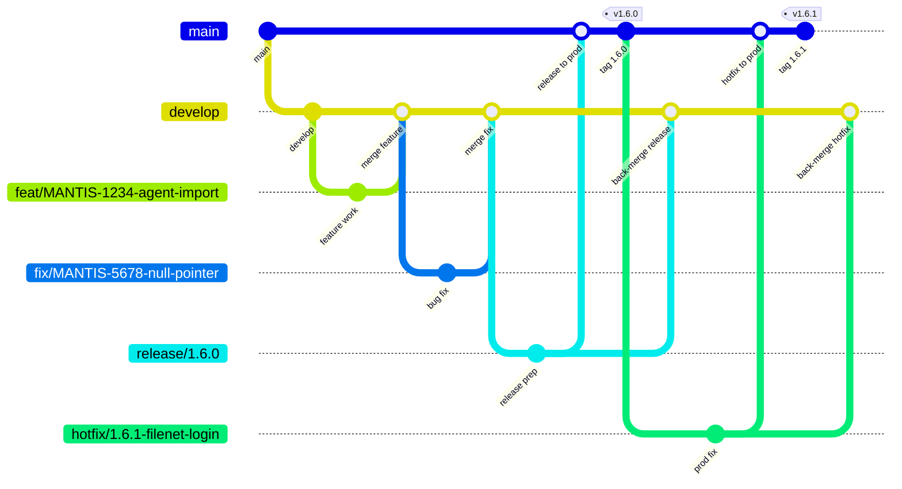

# ECM Git Standards

**Parent:** [ECM Core Software Development Standards](../core/STANDARDS.md)  
**Applies to:** Branching, pull requests, and release flow for ECM repositories

---

## Table of Contents

- [Intent](#intent)
- [What is a Branch?](#what-is-a-branch)
- [Working Branches](#working-branches)
  - [Main](#main)
  - [Develop](#develop)
  - [Default branch](#default-branch)
- [Branch Naming Conventions](#branch-naming-conventions)
- [GitFlow Workflow](#gitflow-workflow)
  - [Overview](#overview)
  - [Feature, fix, and chore branches](#feature-fix-and-chore-branches)
  - [Release branches](#release-branches)
  - [Hotfix branches](#hotfix-branches)
  - [Rules](#rules)
- [What is a Pull Request?](#what-is-a-pull-request)
- [Relationship Between Branch and PR](#relationship-between-branch-and-pr)
- [Best Practices](#best-practices)
- [ISO and Audit](#iso-and-audit)

---

## Intent

This document defines how ECM teams create, name, and merge Git branches. The goal is a shared workflow that keeps production stable, makes development work easy to review, and makes it obvious why a branch exists and where it should land. Follow these conventions so pull requests stay small, releases stay predictable, and production fixes can be isolated from in-progress work.

---

## What is a Branch?

A branch is a version of the source code in Git. It is used to develop features, fix bugs, or experiment independently from the main code line.

Key characteristics of a branch:

- Exists in Git
- Contains actual code changes
- Used by developers to work independently

Examples:

- `feat/MANTIS-1234-agent-import`
- `fix/MANTIS-5678-null-pointer`
- `hotfix/PROD-901-login`

---

## Working Branches

The repository has two long-lived core branches: `main` and `develop`.

GitFlow separates ongoing development, released code, new features, bug fixes, and hotfixes into dedicated branches, so that:

- Production is always stable
- Multiple features can be developed in parallel
- Releases are controlled and auditable

### Main

`main` holds production-ready code.

- Every commit on `main` represents a released version
- It is protected: pull request and approvals only
- Releases are tagged with versions (for example `v1.4.0`)
- `main` is updated only by a release or a hotfix

### Develop

`develop` is the integration branch.

- It contains all completed features for the next release
- Most pull requests eventually land here
- It is always potentially releasable, but it is not production
- `develop` is updated by feature, fix, chore, and release/hotfix back-merges

Do not commit directly to `main` or `develop`. All work lands through a pull request.

### Default branch

The default branch of every repository is `main`. It represents the production-ready codebase.

`develop` is used solely for integration and is never configured as the default branch.

| Reason | Explanation |
| --- | --- |
| Production represents truth | `main` always reflects what is in production, or what is approved to go live |
| Safety | Prevents accidental pull requests or commits against unstable code |
| Governance and audits | Release history is clean and traceable |
| CI/CD clarity | Pipelines triggered on `main` are production pipelines |
| Industry standard | GitHub, Azure DevOps, and GitLab assume `main` as the default |

Rule of thumb: the default branch must be the least frequently changed and the most protected branch.

Do not use `develop` as the default. That introduces risk:

- Developers may accidentally open pull requests against `develop` instead of a feature branch, or push directly to `develop`
- `develop` is intentionally unstable
- Releases become harder to audit
- Responsibility between development and release readiness is blurred

`develop` is a working branch, not a governance anchor.

---

## Branch Naming Conventions

- Features - `feat/{TICKET_ID}-{FEATURE_DESCRIPTION}`
- Bug fixes - `fix/{TICKET_ID}-{FIX_DESCRIPTION}`
- Prod issues - `hotfix/{TICKET_ID}-{FIX_DESCRIPTION}`
- Enhancements - `chore/{BRANCH_DESCRIPTION}`
- Releases - `release/{BRANCH_DESCRIPTION}{version}`

Use lowercase kebab-case in the description. Keep names short and specific.

```text
feat/MANTIS-1234-agent-import
feat/BT-456-document-search
fix/MANTIS-5678-null-pointer
hotfix/PROD-901-login
hotfix/1.6.1-filenet-login-fix
chore/upgrade-eslint
release/1.6.0
```

---

## GitFlow Workflow

ECM uses GitFlow. Short-lived branches start from the correct core branch, and they merge back so `develop` stays current and `main` stays production-safe.

### Overview



Read the diagram left to right:

- `develop` branches from `main` and remains the day-to-day integration line
- Features and fixes branch from `develop` and merge back into `develop`
- A release branch is cut from `develop`, merged into `main`, tagged, and merged back into `develop`
- A hotfix branches from `main`, is merged into `main`, tagged, and merged back into `develop` so the fix is not lost

```text
main     ●──────────────────────────────● v1.6.0 ──● v1.6.1
          \                            /          /
develop    ●────●────●──────────●────●──────────●
                 \    \        /    /
feat/fix/chore    ●    ●──────●    /
release                         ●──
hotfix                                   ●────────
```

### Feature, fix, and chore branches

These supporting branches carry planned work. They always start from the latest `develop`.

| Type | Branch from | Merge into | When to use |
| --- | --- | --- | --- |
| `feat/` | `develop` | `develop` | New features or improvements |
| `fix/` | `develop` | `develop` | A defect found in development or a non-production environment |
| `chore/` | `develop` | `develop` | Tooling, dependencies, cleanup, or other non-feature work |

Typical path:

- Update `develop` and create the branch from it
- Keep commits focused on the ticket. Rebase or merge `develop` into the branch if it falls behind
- Open a pull request into `develop`
- After review and CI pass, merge the pull request. Delete the short-lived branch

Do not merge a `feat/`, `fix/`, or `chore/` branch into `main`. Those changes reach production only through a release.

Examples:

- `feat/MANTIS-123-add-audit-log`
- `feat/BT-456-document-search`

### Release branches

A release branch prepares a version of `develop` for production. It isolates last-mile work from new features that continue on `develop`.

- Created from: `develop`
- Used for final testing, bug fixes, version bumps, and documentation updates
- Merged into: `main` (for the release) and `develop` (to keep those changes)

Typical path:

- Create `release/{BRANCH_DESCRIPTION}{version}` from `develop` when the set of changes is ready to ship
- Only release-blocking fixes and release metadata belong on this branch. New features stay on `develop`
- Open a pull request from the release branch into `main`
- After merge, tag `main` with the version (for example `v1.6.0`)
- Merge the same release branch back into `develop` so release-only fixes are not lost
- Delete the release branch

Example: `release/1.6.0`

After a successful release, `main` is the production snapshot and `develop` contains that snapshot plus any work that continued during the release.

### Hotfix branches

A hotfix is an urgent production defect. It must not wait for the next planned release, and it must not pick up unfinished work from `develop`.

- Created from: `main`
- Merged into: `main` and `develop`

Typical path:

- Create `hotfix/{TICKET_ID}-{FIX_DESCRIPTION}` from `main`
- Keep the change as small as possible. Fix only the production issue
- Open a pull request into `main`
- After merge, tag `main` with the patch version (for example `v1.6.1`)
- Merge the hotfix back into `develop` (or into an open release branch if one exists, then into `develop`)
- Delete the hotfix branch

Example: `hotfix/1.6.1-filenet-login-fix`

The back-merge is required. If a hotfix lands only on `main`, the next release from `develop` can overwrite the production fix.

### Rules

- `main` is the default branch and always points at production. Never force-push `main` or `develop`
- `develop` is the integration branch. Day-to-day pull requests target `develop`
- Features, fixes, and chores branch from `develop` and merge back to `develop`
- Releases branch from `develop` and merge to both `main` and `develop`
- Hotfixes branch from `main` and merge to both `main` and `develop`
- Every merge into a core branch goes through a pull request, CI, and the [code review checklist](../core/CODE_REVIEW_CHECKLIST.md)
- Delete short-lived branches after they are merged

---

## What is a Pull Request?

A Pull Request (PR) is a request to merge one branch into another branch. It enables code review, discussion, automated checks, and approvals.

Key characteristics of a PR:

- Exists in GitHub (or a similar platform)
- Does not contain code itself but references a branch
- Used for review, approval, and auditability

Examples:

- `feat/MANTIS-1234-agent-import` → `develop`
- `release/1.6.0` → `main`
- `hotfix/PROD-901-login` → `main`

---

## Relationship Between Branch and PR

A Pull Request always refers to a branch. The typical flow is:

- Create a branch
- Commit code changes to the branch
- Open a Pull Request from the branch to the target branch
- Perform code review and approvals
- Merge the Pull Request
- Delete the branch after merge

---

## Best Practices

- One branch per logical change
- One Pull Request per branch
- Do not reuse branches for multiple PRs
- Always link PRs to work items (MantisBT / Bitrix24)

---

## ISO and Audit

For traceability and audit compliance, each Pull Request must be linked to:

- A work item (bug, task, or change request)
- A single branch
- An approved review record
- A release or deployment record

This ensures full traceability from requirement to code, review, and production deployment.
