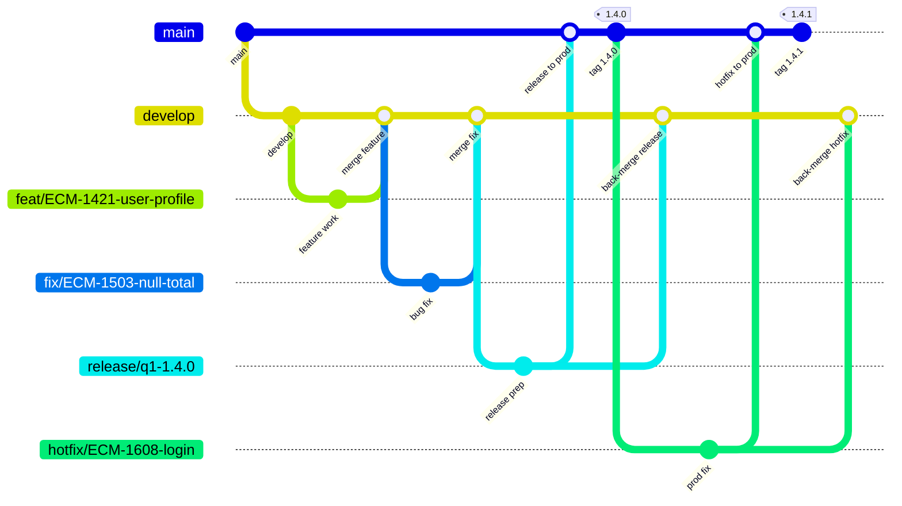

# ECM Git Standards

**Parent:** [ECM Core Software Development Standards](../core/STANDARDS.md)  
**Applies to:** Branching, pull requests, and release flow for ECM repositories

---

## Table of Contents

- [Intent](#intent)
- [Working Branches](#working-branches)
- [Branch Naming Conventions](#branch-naming-conventions)
- [GitFlow Workflow](#gitflow-workflow)
  - [Overview](#overview)
  - [Feature, fix, and chore branches](#feature-fix-and-chore-branches)
  - [Release branches](#release-branches)
  - [Hotfix branches](#hotfix-branches)
  - [Rules](#rules)

---

## Intent

This document defines how ECM teams create, name, and merge Git branches. The goal is a shared workflow that keeps production stable, makes development work easy to review, and makes it obvious why a branch exists and where it should land. Follow these conventions so pull requests stay small, releases stay predictable, and production fixes can be isolated from in-progress work.

---

## Working Branches

The repository has two long-lived core branches:

| Branch | Role |
| --- | --- |
| `main` | Production. It always reflects what is live, or what is approved to go live. |
| `develop` | Development. It is the integration branch for completed features, fixes, and chores that are not yet released. |

- Do not commit directly to `main` or `develop`. All work lands through a pull request.
- `main` is updated only by a release or a hotfix.
- `develop` is updated by feature, fix, chore, and release/hotfix back-merges.

---

## Branch Naming Conventions

- Features - `feat/{TICKET_ID}-{FEATURE_DESCRIPTION}`
- Bug fixes - `fix/{TICKET_ID}-{FIX_DESCRIPTION}`
- Prod issues - `hotfix/{TICKET_ID}-{FIX_DESCRIPTION}`
- Enhancements - `chore/{BRANCH_DESCRIPTION}`
- Releases - `release/{BRANCH_DESCRIPTION}{version}`

Use lowercase kebab-case in the description. Keep names short and specific.

```text
feat/ECM-1421-user-profile-page
fix/ECM-1503-null-order-total
hotfix/ECM-1608-login-timeout
chore/upgrade-eslint
release/q1-stabilisation1.4.0
```

---

## GitFlow Workflow

ECM uses GitFlow. Short-lived branches start from the correct core branch, and they merge back so `develop` stays current and `main` stays production-safe.

### Overview



Read the diagram left to right:

1. `develop` branches from `main` and remains the day-to-day integration line.
2. Features and fixes branch from `develop` and merge back into `develop`.
3. A release branch is cut from `develop`, merged into `main`, tagged, and merged back into `develop`.
4. A hotfix branches from `main`, is merged into `main`, tagged, and merged back into `develop` so the fix is not lost.

```text
main     ●──────────────────────────────● v1.4.0 ──● v1.4.1
          \                            /          /
develop    ●────●────●──────────●────●──────────●
                 \    \        /    /
feat/fix/chore    ●    ●──────●    /
release                         ●──
hotfix                                   ●────────
```

### Feature, fix, and chore branches

These branches carry planned work. They always start from the latest `develop`.

| Type | Branch from | Merge into | When to use |
| --- | --- | --- | --- |
| `feat/` | `develop` | `develop` | New behaviour or a user-facing feature |
| `fix/` | `develop` | `develop` | A defect found in development or a non-production environment |
| `chore/` | `develop` | `develop` | Tooling, dependencies, cleanup, or other non-feature work |

Typical path:

1. Update `develop` and create the branch from it.
2. Keep commits focused on the ticket. Rebase or merge `develop` into the branch if it falls behind.
3. Open a pull request into `develop`.
4. After review and CI pass, merge the pull request. Delete the short-lived branch.

Do not merge a `feat/`, `fix/`, or `chore/` branch into `main`. Those changes reach production only through a release.

### Release branches

A release branch prepares a version of `develop` for production. It isolates last-mile work (version numbers, release notes, regression fixes) from new features that continue on `develop`.

1. Create `release/{BRANCH_DESCRIPTION}{version}` from `develop` when the set of changes is ready to ship.
2. Only release-blocking fixes and release metadata belong on this branch. New features stay on `develop`.
3. Open a pull request from the release branch into `main`.
4. After merge, tag `main` with the version (for example `1.4.0`).
5. Merge the same release branch back into `develop` so release-only fixes are not lost.
6. Delete the release branch.

After a successful release, `main` is the production snapshot and `develop` contains that snapshot plus any work that continued during the release.

### Hotfix branches

A hotfix is an urgent production defect. It must not wait for the next planned release, and it must not pick up unfinished work from `develop`.

1. Create `hotfix/{TICKET_ID}-{FIX_DESCRIPTION}` from `main`.
2. Keep the change as small as possible. Fix only the production issue.
3. Open a pull request into `main`.
4. After merge, tag `main` with the patch version (for example `1.4.1`).
5. Merge the hotfix back into `develop` (or into an open release branch if one exists, then into `develop`).
6. Delete the hotfix branch.

The back-merge is required. If a hotfix lands only on `main`, the next release from `develop` can overwrite the production fix.

### Rules

- `main` always points at production. Never force-push `main` or `develop`.
- `develop` is the default integration branch. Day-to-day pull requests target `develop`.
- Features, fixes, and chores branch from `develop` and merge back to `develop`.
- Releases branch from `develop` and merge to both `main` and `develop`.
- Hotfixes branch from `main` and merge to both `main` and `develop`.
- Every merge into a core branch goes through a pull request, CI, and the [code review checklist](../core/CODE_REVIEW_CHECKLIST.md).
- Delete short-lived branches after they are merged.
